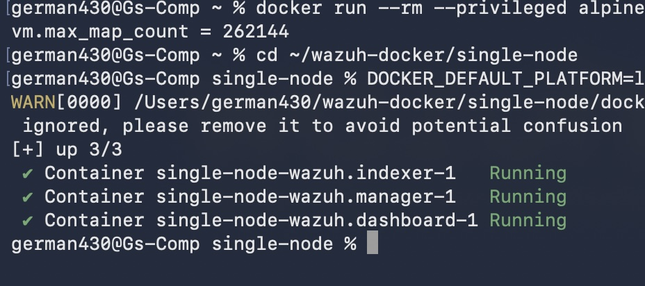
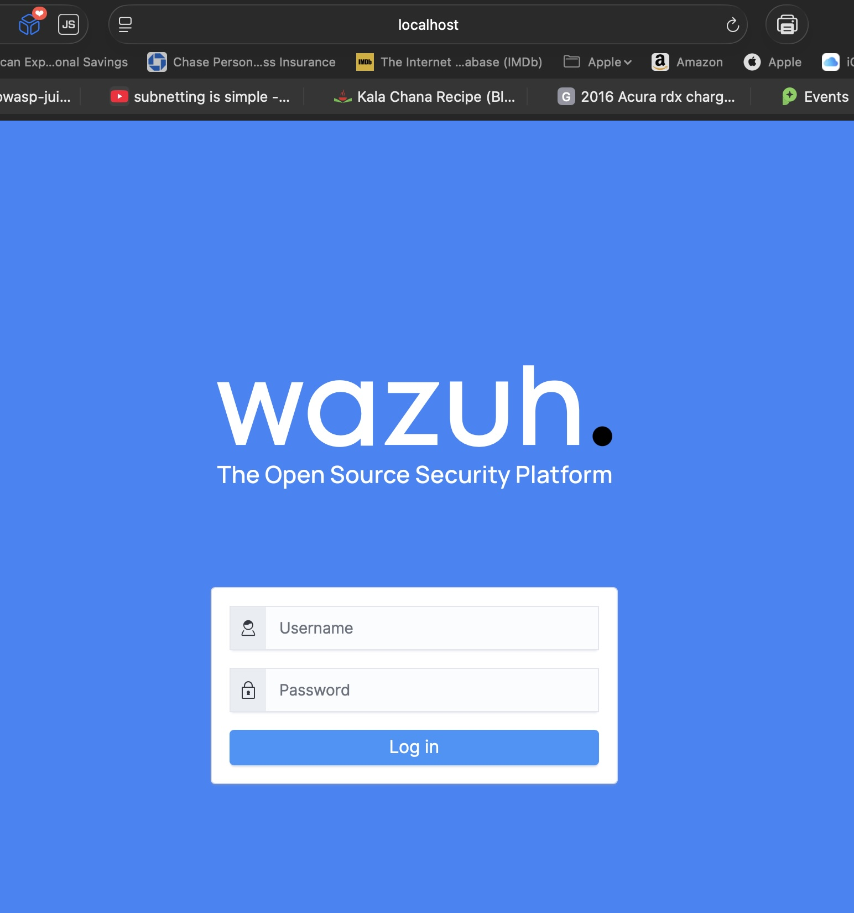
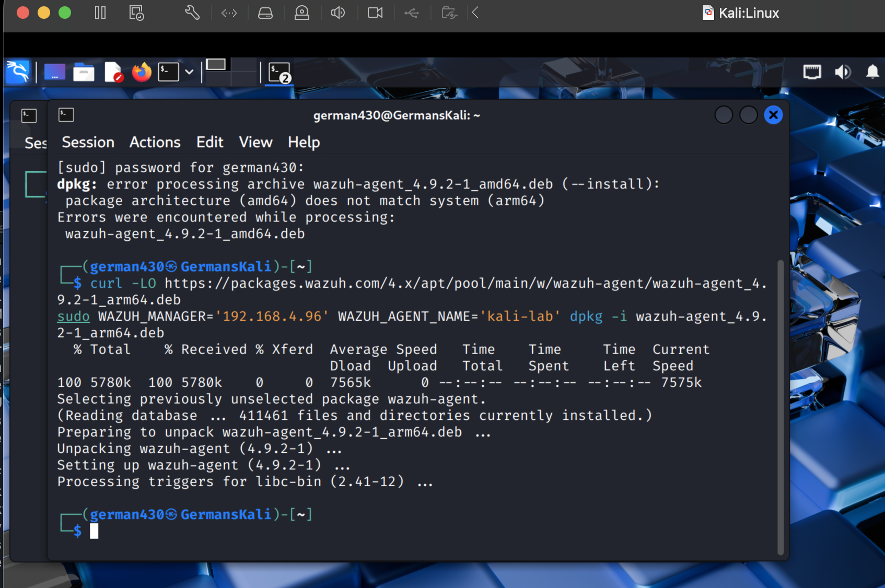
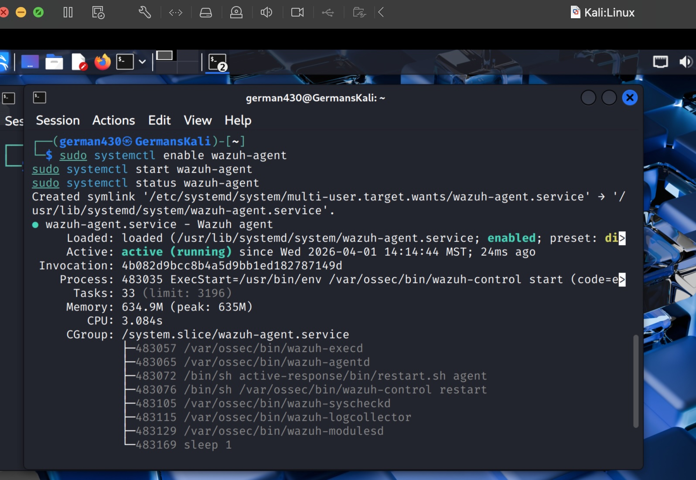
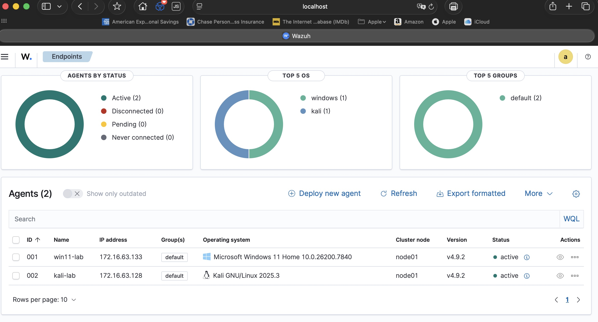
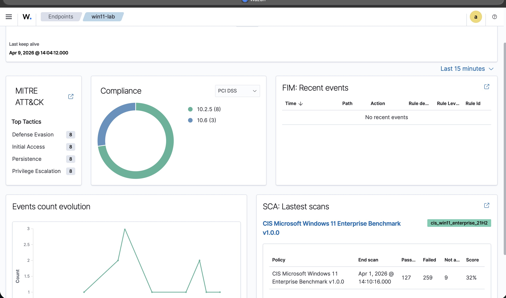
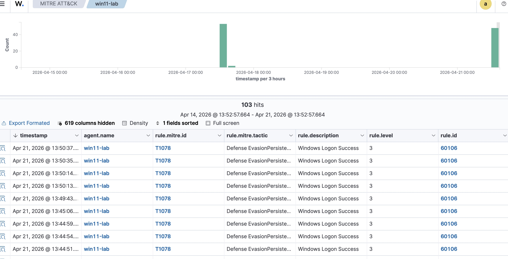
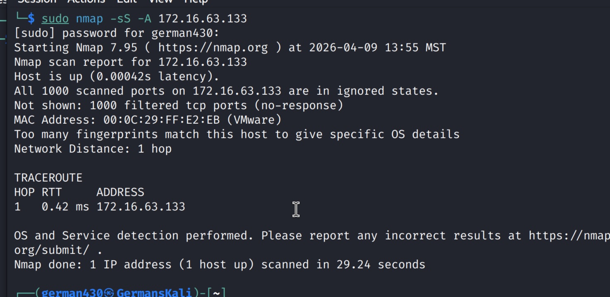
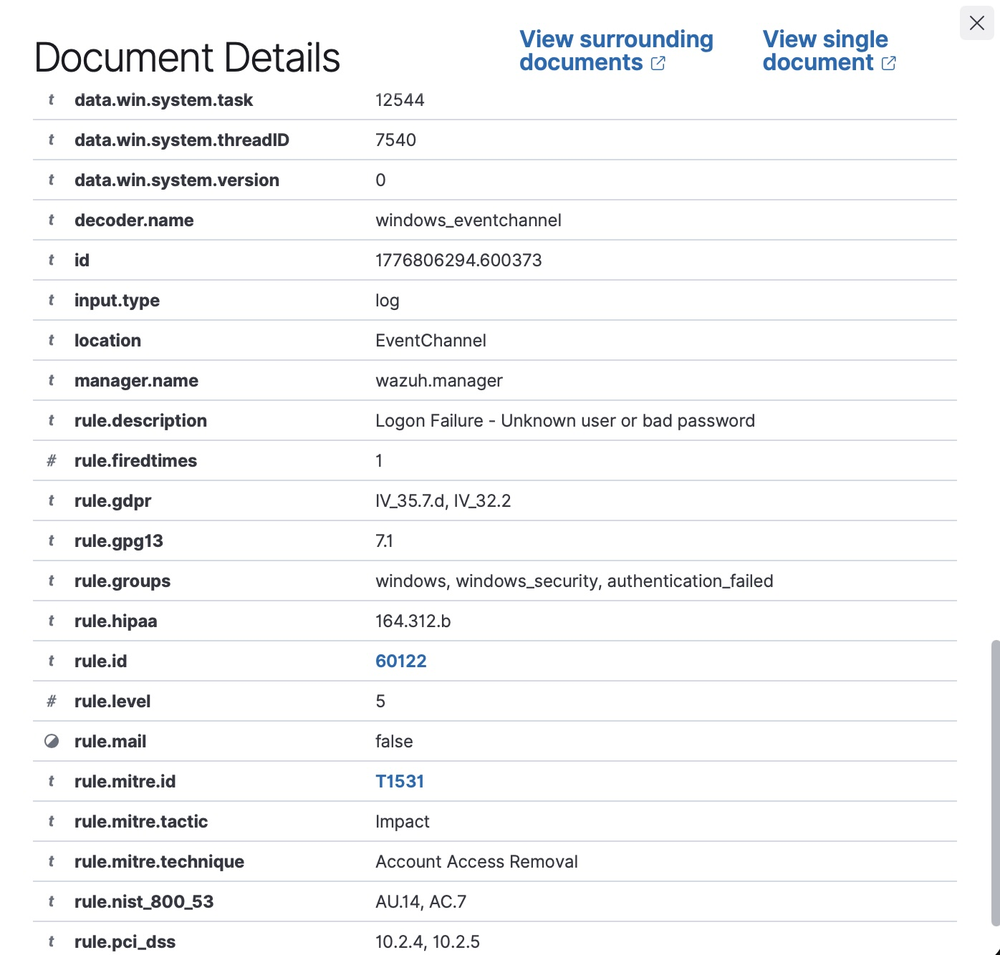
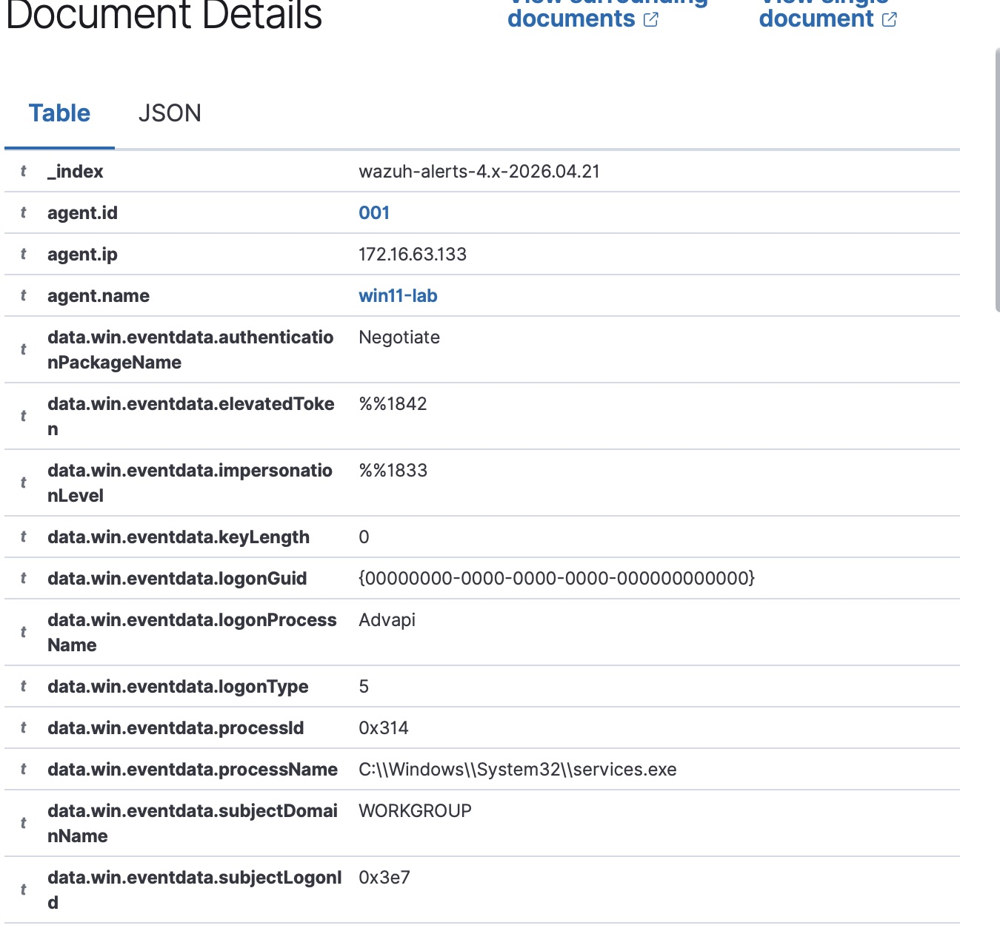

[wazuh-siem-lab-README.md](https://github.com/user-attachments/files/27068171/wazuh-siem-lab-README.md)
# Wazuh SIEM Home Lab — Threat Detection & Attack Simulation

**Author:** German Abarca  
**GitHub:** github.com/German430  
**Platform:** Wazuh v4.9.2 (Docker) | VMware Fusion | macOS M1 Max  
**Status:** Complete

---

## Project Overview

This project documents the design, deployment, and operation of a home SIEM lab using Wazuh, an open-source security monitoring platform. The lab simulates real-world attack scenarios from a Kali Linux attacker VM against a Windows 11 target, with Wazuh monitoring and alerting on detected activity.

The goal is twofold: develop hands-on defensive security skills and produce a documented detection pipeline that maps offensive techniques to MITRE ATT&CK tactics — mirroring the workflow of a SOC Analyst or Incident Responder.

---

## Lab Architecture

```
┌─────────────────────────────────────────────────────────┐
│                  MacBook Pro M1 Max (Host)              │
│                                                         │
│  ┌──────────────────────────────────┐                   │
│  │     Docker Desktop (LinuxKit)    │                   │
│  │                                  │                   │
│  │  ┌──────────┐  ┌──────────────┐  │                   │
│  │  │  Wazuh   │  │   Wazuh      │  │                   │
│  │  │ Manager  │  │  Dashboard   │  │                   │
│  │  └──────────┘  └──────────────┘  │                   │
│  │  ┌──────────────────────────┐    │                   │
│  │  │  OpenSearch (Indexer)    │    │                   │
│  │  └──────────────────────────┘    │                   │
│  └──────────────────────────────────┘                   │
│           ↑ agents report via host IP                   │
│                                                         │
│  ┌─────────────────┐   ┌─────────────────┐             │
│  │   Kali Linux    │   │  Windows 11     │             │
│  │   (Attacker)    │   │  (Target)       │             │
│  │   + Wazuh Agent │   │  + Wazuh Agent  │             │
│  └─────────────────┘   └─────────────────┘             │
└─────────────────────────────────────────────────────────┘
```

**Network:** VMware NAT — VMs communicate with each other and reach the Docker-hosted Wazuh manager via the Mac host IP.

---

## Tools & Technologies

| Category | Tool |
|---|---|
| SIEM Platform | Wazuh v4.9.2 |
| Deployment | Docker Desktop (single-node compose) |
| Hypervisor | VMware Fusion |
| Attacker OS | Kali Linux 2025.3 (ARM64) |
| Target OS | Windows 11 Home 10.0.26200.7840 |
| Recon | Nmap 7.95 |
| Credential Attack | CrackMapExec |
| Framework | MITRE ATT&CK |

---

## Phase 1 — Environment Setup

### Deployment

Wazuh was deployed on the Mac host using Docker Compose rather than a dedicated VM, keeping resource overhead low while freeing VMware capacity for the attacker and target VMs.

Key deployment notes:
- Used official Wazuh Docker single-node compose at v4.9.2
- Applied `vm.max_map_count=262144` to Docker's LinuxKit VM (required by OpenSearch)
- Generated SSL certificates via the included `generate-indexer-certs.yml` before first launch
- Remapped host ports to avoid conflicts with Docker Desktop's reserved ports on macOS


*All three Wazuh containers running: indexer, manager, dashboard*


*Wazuh Dashboard accessible at https://localhost*

### Agent Enrollment

Both endpoints were registered via the Wazuh API and enrolled with authentication keys. The Kali agent required the ARM64 package due to the Apple Silicon host architecture.


*Kali agent installed using ARM64 .deb package*


*Kali agent service active and running*


*Both win11-lab and kali-lab showing Active in the Wazuh Dashboard*

| Agent | OS | IP | Role | Status |
|---|---|---|---|---|
| `win11-lab` | Windows 11 Home 10.0.26200.7840 | 172.16.63.133 | Target / monitored endpoint | Active |
| `kali-lab` | Kali GNU/Linux 2025.3 | 172.16.63.128 | Attacker / monitored endpoint | Active |

---

## Phase 2 — Baseline & Passive Detections

Once agents were enrolled, Wazuh immediately began collecting Windows Security Event logs and running automated assessments — no attack simulation required.

### Security Configuration Assessment (SCA)

Wazuh automatically ran the **CIS Microsoft Windows 11 Enterprise Benchmark v1.0.0** against the target VM.


*Wazuh endpoint dashboard showing MITRE ATT&CK hits, PCI DSS compliance, and SCA results*

| Policy | Passed | Failed | Score |
|---|---|---|---|
| CIS Windows 11 Enterprise v1.0.0 | 127 | 259 | 32% |

A 32% score indicates significant security misconfigurations on a default Windows 11 installation — consistent with real-world findings on unmanaged endpoints. This data alone represents actionable hardening guidance.

### Passive MITRE ATT&CK Detections

Within 7 days of agent enrollment, Wazuh generated **103 MITRE ATT&CK mapped alerts** from normal Windows activity alone. This demonstrates a key SOC concept: legitimate system behavior frequently overlaps with known attacker techniques — a primary driver of alert fatigue in real SOC environments.


*MITRE ATT&CK overview showing tactics and alert distribution over time*

| Tactic | Technique | Rule ID | Level | Description |
|---|---|---|---|---|
| Defense Evasion / Initial Access / Persistence | T1078 — Valid Accounts | 60106 | 3 | Windows Logon Success |

Windows service accounts, scheduled tasks, and user sessions all triggered T1078 mappings — highlighting the importance of baselining normal behavior before tuning alert thresholds.

---

## Phase 3 — Attack Simulations

### Scenario 1 — Network Reconnaissance

**Objective:** Map open ports and identify services on the target  
**Tool:** Nmap 7.95  
**MITRE Tactic:** TA0043 — Reconnaissance  
**MITRE Technique:** T1046 — Network Service Discovery  

**Command:**
```bash
sudo nmap -sS -A 172.16.63.133
```

**Initial scan result (Windows Firewall enabled):**


*First scan with Windows Firewall enabled — host confirmed up, all 1000 ports filtered*

With the firewall active, all 1000 ports returned filtered/no-response. After disabling the firewall for lab purposes, the scan revealed:

| Port | State | Service |
|---|---|---|
| 135/tcp | Open | Microsoft Windows RPC |
| 139/tcp | Open | NetBIOS-SSN |
| 445/tcp | Open | SMB |

**Additional Intel Gathered:**
- Hostname: `GSWINDOWSVM`
- Domain: `GsWindowsvm`
- OS: Windows confirmed via TCP/IP fingerprint
- SMB signing: enabled and required
- MAC: `00:0C:29:FF:E2:EB` (VMware)

**Wazuh Detection:** ⚠️ Not detected — detection gap identified

Network-layer Nmap scans are invisible to host-based agents without supplemental tooling. Sysmon with network connection logging or a dedicated network IDS (Suricata) would be required to catch reconnaissance at this layer.

**MITRE Mapping:**

| Field | Value |
|---|---|
| Tactic | TA0043 — Reconnaissance |
| Technique | T1046 — Network Service Discovery |
| Severity | Informational |
| Remediation | Deploy Sysmon with SwiftOnSecurity config; implement Suricata for network-layer detection |

---

### Scenario 2 — SMB Authentication Attack (Pass the Hash / NTLM Abuse)

**Objective:** Attempt credential-based access to SMB service using NTLM authentication  
**Tool:** CrackMapExec  
**MITRE Tactics:** TA0008 Lateral Movement, TA0005 Defense Evasion, TA0004 Privilege Escalation, TA0001 Initial Access  
**MITRE Techniques:** T1550.002 — Pass the Hash, T1078.002 — Valid Accounts: Domain Accounts  

**Command:**
```bash
crackmapexec smb 172.16.63.133 -u administrator -p wrongpassword --no-bruteforce
```

**CrackMapExec Output:**
```
SMB  172.16.63.133  445  GSWINDOWSVM  [*] Windows 11 / Server 2025 Build 26100 x64
SMB  172.16.63.133  445  GSWINDOWSVM  [-] Connection Error: The NETBIOS connection timed out
```

**Wazuh Detection:** ✅ Two alerts fired

---

#### Alert 1 — Rule 60122 (Level 5)


*Rule 60122 — Logon Failure alert with full compliance framework mappings*

| Field | Value |
|---|---|
| Rule ID | 60122 |
| Rule Level | 5 |
| Description | Logon Failure — Unknown user or bad password |
| MITRE Technique | T1531 — Account Access Removal |
| MITRE Tactic | Impact |
| Groups | windows, windows_security, authentication_failed |
| GDPR | IV_35.7.d, IV_32.2 |
| HIPAA | 164.312.b |
| NIST 800-53 | AU.14, AC.7 |
| PCI DSS | 10.2.4, 10.2.5 |

---

#### Alert 2 — Rule 92652 (Level 6)


*Events table showing both Rule 60122 (Level 5) and Rule 92652 (Level 6) firing simultaneously*


*Rule 92652 — Level 6 Pass the Hash alert — highest severity finding in this lab*

| Field | Value |
|---|---|
| Rule ID | 92652 |
| Rule Level | 6 |
| Description | Successful Remote Logon Detected — User: ANONYMOUS LOGON — NTLM authentication, possible pass-the-hash attack |
| MITRE Techniques | T1550.002 — Pass the Hash, T1078.002 — Valid Accounts: Domain Accounts |
| MITRE Tactics | Defense Evasion, Lateral Movement, Persistence, Privilege Escalation, Initial Access |
| Groups | win_evt_channel, windows, authentication_success |
| Windows Event ID | 4624 |
| Authentication Package | Negotiate (NTLM) |
| GDPR | IV_32.2 |
| HIPAA | 164.312.b |

**Why This Matters:**  
CrackMapExec uses NTLM authentication in a way that deviates from standard Windows login patterns — specifically an ANONYMOUS LOGON via Negotiate/NTLM, which Windows logs under Event ID 4624 (logon type 3, network). Wazuh correlated the anomalous authentication method against its Pass the Hash ruleset and generated a Level 6 alert — a severity that would trigger analyst investigation in a real SOC environment.

**MITRE Mapping:**

| Field | Value |
|---|---|
| Primary Tactic | TA0008 — Lateral Movement |
| Secondary Tactics | Defense Evasion, Privilege Escalation, Initial Access, Persistence |
| Techniques | T1550.002 — Pass the Hash, T1078.002 — Domain Accounts |
| Severity | Level 6 (High) |
| Remediation | Enable Windows Credential Guard; restrict NTLM via Group Policy; monitor Event ID 4624 logon type 3 with ANONYMOUS LOGON; implement account tiering |

---

## Key Findings Summary

| # | Scenario | Tool | MITRE Technique | Rule ID | Severity | Detected |
|---|---|---|---|---|---|---|
| 1 | Network Reconnaissance | Nmap | T1046 | — | Info | ⚠️ Detection gap |
| 2 | Logon Failure / Bad Password | CrackMapExec | T1531 | 60122 | Level 5 | ✅ Yes |
| 3 | Pass the Hash / NTLM Abuse | CrackMapExec | T1550.002, T1078.002 | 92652 | Level 6 | ✅ Yes |

---

## Detection Gaps & Tuning Opportunities

| Gap | Cause | Recommendation |
|---|---|---|
| Nmap scan not detected | No Sysmon / network IDS deployed | Add Sysmon with SwiftOnSecurity config; deploy Suricata for network-layer visibility |
| Alert fatigue from T1078 | Normal Windows logins map to Valid Accounts technique | Tune Rule 60106 to suppress known-good service accounts; build allowlist |
| CIS benchmark score 32% | Default Windows 11 hardening is insufficient | Apply CIS Level 1 baseline controls; prioritize top failed benchmarks |

---

## Lessons Learned

**Defensive perspective:**  
A default Windows 11 installation scores 32% against CIS benchmarks — well below acceptable thresholds for any managed environment. Automated SCA tooling like Wazuh makes this assessment continuous rather than point-in-time.

**SOC perspective:**  
Alert fatigue is real. 103 alerts generated by normal system activity in 7 days demonstrates why rule tuning and baselining are core SOC skills. A raw alert count without context is noise; mapped, prioritized, and tuned alerts are intelligence.

**Detection engineering:**  
Network-layer attacks like Nmap are invisible to host-based agents without supplemental tooling. Defense in depth — host agents plus network monitoring — is required for full coverage. The Pass the Hash detection at Level 6 demonstrates that Wazuh's out-of-the-box rules are effective for known credential abuse patterns even without Sysmon.

---

## Repository Structure

```
wazuh-siem-lab/
├── README.md
└── assets/
    └── screenshots/
        ├── WazuhCLcontainerrunning.jpg
        ├── Wazuhuponlocalhost.jpg
        ├── WazuhinstallagentKali.png
        ├── WazuhKalistartagent.jpg
        ├── WazuhBothagentsup.jpg
        ├── WazuhScanresults1.jpg
        ├── Wazuhmitreattacks.jpg
        ├── WazuhInitialkalinmap.jpg
        ├── Wazuhlevel5rule.jpg
        ├── WazuheventsFive_Six.jpg
        └── WazuhEventdetails.jpg
```

---

## About This Lab

This lab was built as part of an active transition into cybersecurity, running alongside CompTIA Security+ certification and an eJPT/OSCP study track. All attacks were conducted in an isolated VMware environment against intentionally configured targets. No external systems were targeted.
